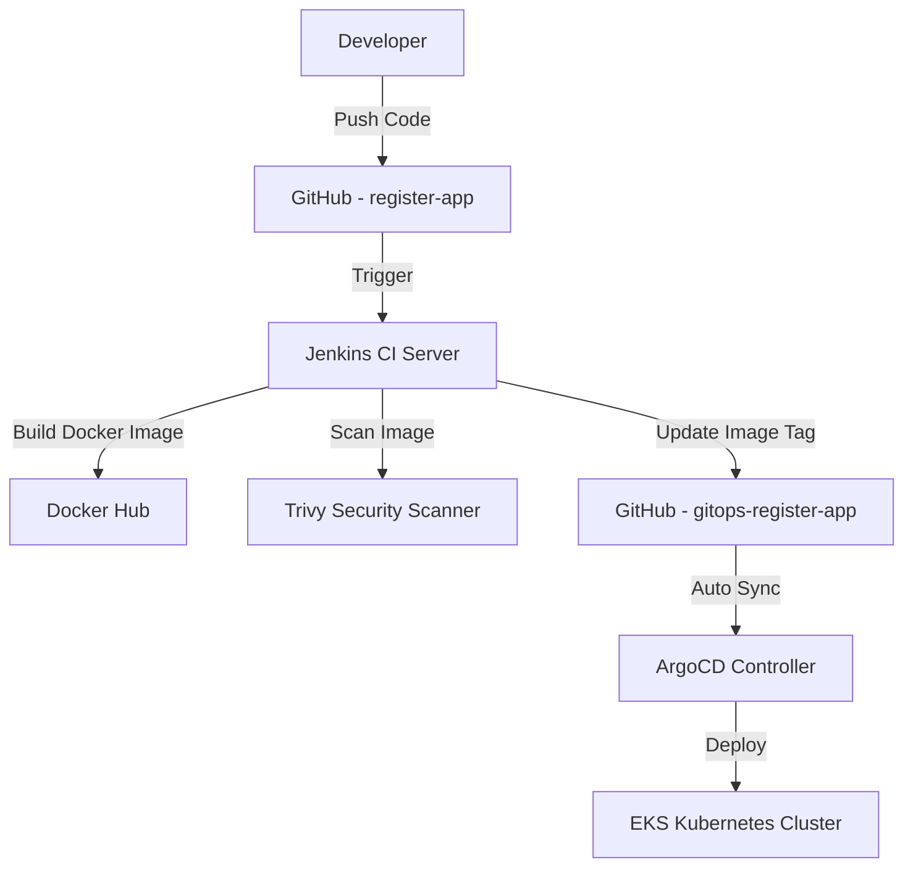

# Register App - End-to-End DevOps CI/CD Pipeline

Welcome to the **Register App** DevOps project! This project showcases an end-to-end CI/CD pipeline using **Jenkins**, **Docker**, **Trivy**, **ArgoCD**, **EKS**, and **GitOps** principles. It follows a modern DevOps approach where CI and CD responsibilities are decoupled into separate repositories.

---

## Table of Contents

* [Overview](#overview)
* [Architecture Diagram](#architecture-diagram)
* [Technologies Used](#technologies-used)
* [Project Structure](#project-structure)
* [CI/CD Pipeline Flow](#cicd-pipeline-flow)
* [Step-by-Step Implementation](#step-by-step-implementation)

  * [1. Setup Jenkins CI Server](#1-setup-jenkins-ci-server)
  * [2. Configure Docker Build and Push](#2-configure-docker-build-and-push)
  * [3. Implement Trivy Image Scanning](#3-implement-trivy-image-scanning)
  * [4. Artifact Cleanup](#4-artifact-cleanup)
  * [5. GitOps with ArgoCD for CD](#5-gitops-with-argocd-for-cd)
* [GitHub Repositories](#github-repositories)
* [Screenshots](#screenshots)
* [Conclusion](#conclusion)

---

## Overview

This project demonstrates how to design and deploy a fully automated CI/CD pipeline for a Node.js-based registration application. The pipeline builds, scans, and deploys the application to Kubernetes using **GitOps methodology** with **ArgoCD**.

It is based on the industry-standard practices and automates the entire process from code commit to production deployment.

---

## Architecture Diagram



---

## Technologies Used

* **Jenkins** – CI tool for automation.
* **Docker** – Containerization platform.
* **Docker Hub** – Registry to push/pull images.
* **Trivy** – Vulnerability scanner.
* **ArgoCD** – GitOps-based CD tool.
* **Kubernetes (EKS)** – Orchestration and hosting.
* **Helm** – Kubernetes package manager.
* **GitHub** – Source code and GitOps repo.
* **EC2 Instances** – Jenkins server and ArgoCD setup.

---

## Project Structure

### Application Repository (CI): [`register-app`](https://github.com/Manjesh501/register-app)

Contains:

* Node.js application source code
* Dockerfile
* Jenkinsfile for the complete CI pipeline

### GitOps Repository (CD): [`gitops-register-app`](https://github.com/Manjesh501/gitops-register-app)

Contains:

* Kubernetes deployment and service YAMLs
* Image tag is updated via Jenkins automatically
* ArgoCD syncs this repo for CD

---

## CI/CD Pipeline Flow

1. **Code Push to GitHub** triggers Jenkins Pipeline
2. Jenkins:

   * Pulls latest code
   * Builds and tags Docker image
   * Pushes image to DockerHub
   * Scans image using Trivy
   * Updates image tag in `gitops-register-app` repo
3. **ArgoCD** watches the GitOps repo and syncs changes
4. **Application is deployed** to EKS cluster automatically

---

## Step-by-Step Implementation

### 1. Setup Jenkins CI Server

* Created EC2 instance and installed Jenkins
* Installed necessary plugins:

  * Git, Docker, Trivy, Blue Ocean, GitHub, Pipeline, etc.
* Configured Jenkins global credentials:

  * GitHub Token
  * Docker Hub credentials
  * EC2 SSH Key for GitOps repo

### 2. Configure Docker Build and Push

* Dockerfile added in app repo:

  ```Dockerfile
  FROM node:alpine
  WORKDIR /app
  COPY . .
  RUN npm install
  CMD ["npm", "start"]
  ```
* Jenkins builds image with tag: `register-app:<BUILD_ID>`
* Image is pushed to Docker Hub

### 3. Implement Trivy Image Scanning

* Trivy CLI installed on Jenkins server
* Scans the newly built image
* Fails the build if critical vulnerabilities are found
* Example Jenkins stage:

  ```groovy
  stage('Trivy Scan') {
    steps {
      sh 'trivy image manjesh501/register-app:${BUILD_ID}'
    }
  }
  ```

### 4. Artifact Cleanup

* Clean up old images and workspace
* Use `docker rmi` and `docker system prune` for Jenkins host

### 5. GitOps with ArgoCD for CD

* Installed ArgoCD on EKS using manifests
* Exposed ArgoCD server using Ingress/NLB
* Logged into ArgoCD UI and connected `gitops-register-app` repo
* Set auto-sync so changes in repo are deployed automatically
* Jenkins pushes new tag into deployment YAML:

  ```yaml
  containers:
    - name: register
      image: manjesh501/register-app:<BUILD_ID>
  ```

---

## GitHub Repositories

* CI Repo: [register-app](https://github.com/Manjesh501/register-app)
* GitOps Repo: [gitops-register-app](https://github.com/Manjesh501/gitops-register-app)

---

## Screenshots

*To be added manually by the user.* Suggested:

* Jenkins build view
* Trivy scan output
* DockerHub image
* ArgoCD UI with synced status
* Deployed app running in browser

---

## Conclusion

This project demonstrates a complete CI/CD setup using modern DevOps tools and practices:

* Clean separation of CI and CD logic across two repos
* Use of GitOps for secure and declarative deployments
* Automated vulnerability scanning and rollback capabilities

It serves as a strong foundation for enterprise-ready DevOps pipelines. You can extend this by adding:

* SonarQube for code quality
* Slack notifications from Jenkins
* Prometheus + Grafana for monitoring

---

> Feel free to fork this repo, raise issues, or contribute improvements!
